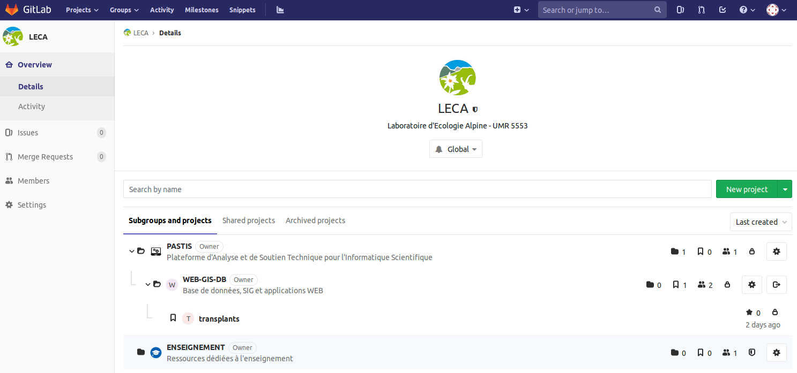
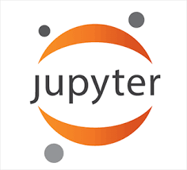

---
output:
  html_document:
    number_sections: no
    toc: no
  # pdf_document:
  #   toc: no
  #   fig_caption: true
---

<br/><br/>


```{css, echo=FALSE}
@import url('https://fonts.googleapis.com/css?family=Londrina+Solid:200,300|Medula+One');
header {
   font-family: 'Londrina Solid', cursive;
   font-weight: 300;
   font-size: 50px;
   line-height: 1.1;
   background-color: #d8d5d5;
   padding: 10px;
   margin-bottom: 50px;
   border-radius: 3px;
   color: #50555e;
}
h2 {
   background-color: #d8d5d5;
   padding: 10px;
   border-radius: 3px;
}
footer {
   background-color: #d8d5d5;
   padding: 10px;
   border-radius: 3px;
   text-align: right;
}
```

<header>Newsletter Pastis - Décembre 2018 </header>

<div style="text-align:right;">*En [bleu](), liens cliquables !*</div>
<br/>

#### Derniers évènements

- *27 novembre 2018* : journée utilisateurs CIMENT (Gricad)  
Présentations disponibles ici : [gricad-user](https://gricad-user-18.sciencesconf.org/resource/page/id/1)
- *28 novembre 2018* : inauguration Dahu-Yéti-Nova (Gricad)  
Présentations disponibles ici : [gricad](https://gricad.univ-grenoble-alpes.fr/actualites/2018-11-08/inauguration-dahu-yeti-et-nova)

<br/><br/>

Après les deux journées organisées par [`Gricad`](https://gricad.univ-grenoble-alpes.fr/), voici un aperçu de quelques points d'intérêts pour le laboratoire  
(information principale ici, informations détaillées plus bas) :

<br/>

#### Machines Ciment

La famille Ciment s'agrandit et se dote de **nouvelles machines** :

- [DAHU](https://gricad.univ-grenoble-alpes.fr/sites/gricad/files/Mediatheque/animations/InaugurationHPCDANova/hpcda.pdf) : 72 noeuds de 16 coeurs et 192 Go de RAM chacun
- [YETI](https://gricad.univ-grenoble-alpes.fr/sites/gricad/files/Mediatheque/animations/InaugurationHPCDANova/hpcda.pdf) : 4 *fat* noeuds de 768 Go de RAM chacun
- [bettik]() : 500 To actuellement, bientôt 700 To

A savoir que tout ceci a un coût et que vous êtes les bienvenus pour **participer au financement de nouvelles ressources** !  
Quelques ordres d'idées, sachant que pour avoir des machines homogènes, mieux vaut se lancer avant juin 2020 :

- 1 noeud omnipath : environ 8000 euros
- 1 cable de fibre optique : environ 500 euros
- un chassis complet : environ 37 000 euros ...


<br/>

#### Gricad-Gitlab

Une plateforme de travail collaboratif en version académique permettant de gérer des fichiers et des projets au cours du temps.  
Par exemple, **une excellente solution pour gérer les ressources liées à l'enseignement !**  

- ressources centralisées et partagées entre les intervenants
- suivi de l'évolution des cours au cours du temps
- possibilité d'ouvrir l'accès aux étudiants pour le partage de documents
- etc


<br/>

#### Notebook Jupyter

Un outil en ligne permettant d'obtenir un environnement de travail avec Python, R, ou autre langage de programmation, en ligne.  
Pratique par exemple pour présenter un jeu de données, ou encore réaliser un TD ou une formation :

- à partir du moment où ça marche sur une machine, ça marche sur toutes les machines (seul requis : connexion internet)
- possibilité de travailler depuis chez soi
- etc

<br/><br/>


## [`GRICAD-GITLAB`](https://gricad-gitlab.univ-grenoble-alpes.fr/) 

Une plateforme de travail collaboratif, ou **forge**,  de type `gitlab` ouverte à l'ensemble de la communauté académique de Grenoble.

Une **forge** permet à plusieurs personnes de participer ensemble au développement d'un logiciel ou d'un projet en fournissant des outils :

- de gestion des versions (suivi des modifications de fichiers au cours du temps), ici avec `Git`
- de documentation
- de suivi des bugs
- etc

<br/>

#### Avantages

+ même fonctionnement que **`github`**
+ **niveau académique**, c'est à dire que contrairement à `github`,  
les fichiers peuvent être complètement **privés** et non-accessibles si voulu
+ **accessible directement sans création de compte avec ses identifiants UGA** (agalan)
+ possibilité d'autoriser plus ou moins l'accès (enseignants, partenaires extérieurs, étudiants, etc)

#### Organisation

+ travail de préférence dans des **groupes** (10 projets personnels max autorisés par personne) :  
    - un groupe LECA a déjà été créé, pour y être ajouté, envoyez un mail à [Maya](maya.gueguen@univ-grenoble-alpes.fr)
    - pensez organisation ! **créez des groupes** par groupe de travail / thème / plateforme, **puis créez votre projet dedans**



<br/>

## [`jupyter Hub UGA`](https://jupyterhub.u-ga.fr/) 

Support adapté notamment à la formation / pédagogie, ou à la présentation de jeux de données :

+ **accessible directement sans création de compte avec ses identifiants UGA** (agalan)
+ accès à un **notebook** == serveur (16 coeurs, 128 Go de RAM, 1 To de disque) sur lequel peut être chargé un **kernel**, c'est à dire **un** langage de programmation (Python, R, Ruby, etc)
+ possibilité d'écrire dans le terminal, ou dans des fichiers de type `markdown` directement


<br/><br/>

<footer>*Rédigé par Maya Guéguen, le 3 décembre 2018*</footer>

<br/><br/>
