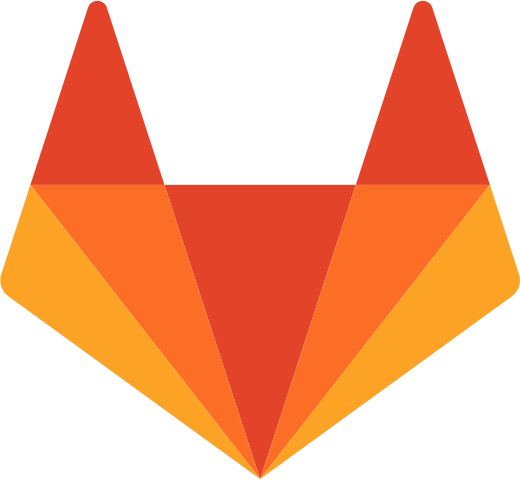
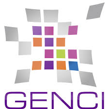

---
output:
  html_document:
    number_sections: no
    toc: no
  # pdf_document:
  #   toc: no
  #   fig_caption: true
---

<br/><br/>


```{css, echo=FALSE}
@import url('https://fonts.googleapis.com/css?family=Londrina+Solid:200,300|Medula+One');
header {
   font-family: 'Londrina Solid', cursive;
   font-weight: 300;
   font-size: 50px;
   line-height: 1.1;
   background-color: #d8d5d5;
   padding: 10px;
   margin-bottom: 50px;
   border-radius: 3px;
   color: #50555e;
}
h2 {
   background-color: #d8d5d5;
   padding: 10px;
   border-radius: 3px;
}
footer {
   background-color: #d8d5d5;
   padding: 10px;
   border-radius: 3px;
   text-align: right;
}
```

<header>Newsletter Pastis - Avril 2019 </header>

<div style="text-align:right;">*En [bleu](), liens cliquables !*</div>
<br/>

#### Derniers évènements

- *février 2019* : questionnaire LECA : plus de clarté demandée !
- *2 avril 2019* : réunion d'échange avec [GENCI](http://www.genci.fr/fr) (Gricad)  
Présentation disponible [ici](documents/Presentation_GENCI_avril-2019.pptx)
- *LSD* : nouveau dossier de partage de scripts sur [`GRICAD-GITLAB`](https://gricad-gitlab.univ-grenoble-alpes.fr/)  
Accessible [ici](https://gricad-gitlab.univ-grenoble-alpes.fr/leca/pastis/lsd) avec identifiants AGALAN


<br/><br/>

**Suite aux journées prospectives et au questionnaire du laboratoire, il ressort un manque de communication sur les compétences de chaque personnel technique, et des modes de fonctionnement des plateformes techniques.**

Nous rappelons donc que l'équipe PASTIS est joignable par mail (leca-pastis-request@univ-grenoble-alpes.fr) (ou directement) pour toute question ou projet relatif :

- au développement en langages de programmation (awk, python, R, C++)
- aux Systèmes d’Informations Géographiques (SIG)
- à la télédétection
- aux bases de données
- à l'analyse de séquences
- aux statistiques et analyses de données

(Détails prochainement disponibles sur le nouveau site web : [PASTIS](https://leca.osug.fr/-PASTIS-))

<div style="text-align:right;">
Fred, Julien, Anthony, Clément, Nicolas, Maya
</div>

<br/><br/>

## [LSD (LECA Script Directory)](https://gricad-gitlab.univ-grenoble-alpes.fr/leca/pastis/lsd) 

Afin de **mutualiser les efforts de programmation**, et d'éviter la perte de temps pour coder une fonction déjà existante,  
nous avons créé le dossier LSD pour **rassembler des scripts à partager**.

Quelques conditions :

- clarté et nettoyage du code
- documentation du code :
    - à quoi ça sert ?
    - quels arguments en entrée ?
    - quels résultats en sortie ?
    - commentaires sur les principales étapes
    
Les fonctions disponibles sont listées [ici](https://gricad-gitlab.univ-grenoble-alpes.fr/leca/pastis/lsd/tree/master/scripts).  
Une description détaillée sera réalisée pour chaque script ([exemple ici](https://gricad-gitlab.univ-grenoble-alpes.fr/leca/pastis/lsd/tree/master/scripts/data_analysis/data_extraction)).
    
<div style="font-size:20px;color:#980043;text-align:center;">
==> Etapes détaillées pour ajouter un nouveau script [ici](https://gricad-gitlab.univ-grenoble-alpes.fr/leca/pastis/lsd)
</div>

En construction également un dossier de **documentation et référencement** de logiciels, programmes ou sites d'aides souvent utilisés [ici](https://gricad-gitlab.univ-grenoble-alpes.fr/leca/pastis/lsd/tree/master/documentation).

N'hésitez pas à nous faire des retours !

<br/><br/>


## [`GENCI`](http://www.genci.fr/fr) 

GENCI est une société civile détenue à :

- 49 % par l’Etat (ministère en charge de l’Enseignement supérieur et la Recherche),
- 20 % par le [CEA](http://www.cea.fr/Pages/PAGES-SPECIALES/Recherche-locale.aspx?k=genci),
- 20 % par le [CNRS](http://archives.cnrs.fr/presse/?r=genci),
- 10 % par les Universités
- et 1 % par [Inria](https://inria.fr/content/search/(keyword)/GENCI).

3 centres calculateurs totalisant 4 machines ([en savoir plus](http://www.genci.fr/fr/content/calculateurs-et-centres-de-calcul)) :

- **Joliot-Curie**, au Très Grand Centre de Calcul (TGCC) du CEA
- **Ada** et **Turing** à l'Institut du Développement et des Ressources en Informatique Scientifique (IDRIS) du CNRS
- **Occigen** au Centre Informatique National de l'Enseignement Supérieur (CINES) pour les Universités

<br/>

#### Fonctionnement

- Budget annuel de 30 millions d'euros (et seulement 15 employés !)
- Achat de calculateurs + ajout d'une tranche / partition tous les 10 mois (augmentation de la puissance)
- Cellule de veille technologique (20-30 experts)
    - test des prototypes
    - préparation des utilisateurs aux nouvelles machines / technologies
- Développement des équipements de calcul au niveau régional avec le projet [Equip@meso](http://www.genci.fr/fr/content/equipmeso)  
(incluant 17 mésocentres sur 55, soit 80% en taille du parc régional)

<br/>

#### Utilisation ([voir présentation](documents/Presentation_GENCI_avril-2019.pptx))

+ Travaux de recherche ouverte : **obligation de publication** (vérification à partir de la 2ème année)
+ Sélection sur critères d’**excellence scientifique**
+ **Financement français** du porteur de projet et **membre permanent** du laboratoire d’appartenance  
(doctorants, post-doctorants etc. ne peuvent être porteur de projet)
+ Accès **gratuit** (ressources ET stockage)

<div style="font-size:20px;color:#980043;text-align:center;">
==> Dossier à remplir sur [www.edari.fr](http://www.edari.fr)
</div>

+ appel à projet tous les 6 mois (janvier, juillet) pour 1 an de calcul
+ compter 4-6 mois pour l'attribution (mai, novembre)
+ évaluation par un groupe d'experts (note scientifique ET technique)
+ possibilité à mi parcours (6 mois) de postuler pour une complémentaire d'heures de 6 mois de +

<div style="font-size:20px;color:#980043;text-align:center;">
==> Demander de l'aide à GRICAD pour monter le dossier
</div>

<br/><br/>


<footer>*Rédigé par Maya Guéguen, le 11 avril 2019*</footer>

<br/><br/>
