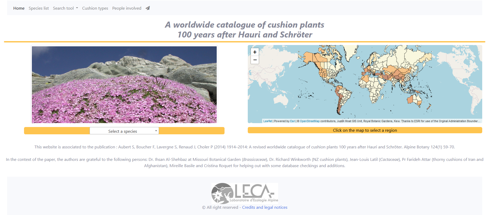

---
output:
  html_document:
    number_sections: no
    toc: no
  # pdf_document:
  #   toc: no
  #   fig_caption: true
---

<br/><br/>


```{css, echo=FALSE}
@import url('https://fonts.googleapis.com/css?family=Londrina+Solid:200,300|Medula+One');
header {
   font-family: 'Londrina Solid', cursive;
   font-weight: 300;
   font-size: 50px;
   line-height: 1.1;
   background-color: #d8d5d5;
   padding: 10px;
   margin-bottom: 50px;
   border-radius: 3px;
   color: #50555e;
}
h2 {
   background-color: #d8d5d5;
   padding: 10px;
   border-radius: 3px;
}
footer {
   background-color: #d8d5d5;
   padding: 10px;
   border-radius: 3px;
   text-align: right;
}
```

<header>Newsletter Pastis - Novembre 2020 </header>

<div style="text-align:right;">*En [bleu](), liens cliquables !*</div>
<br/>


#### Petites news :

- **[Site web LECA](https://leca.osug.fr/)** : 
    - fresh and new, with a complete english version !
    - n'hésitez pas à envoyer un mail si vous voulez *ajouter/updater* une description individuelle, un projet, un nouveau software....
- **[Github 'leca-dev'](https://github.com/leca-dev/)** :
    - en complément du [Gitlab LECA](https://gricad-gitlab.univ-grenoble-alpes.fr/leca/pastis/sharedprojects)
    - si vous voulez partager plus ouvertement un développement, n'hésitez pas à rejoindre l'organisation [leca-dev](https://github.com/leca-dev/) et à créer un projet !
    - ça permet de créer très facilement une page web associée (exemple ici avec les [newsletters LECA](https://leca-dev.github.io/newsletters/) !)
    
    
<br/><br/>

<div style="text-align:center;color:#980043;">
*En ces périodes de confinement, petit changement pour les newsletters PASTIS : *<br/>
*nous allons essayer de vous proposer des newsletters un peu plus fréquentes et à thème !*

*Team PASTIS*
</div>


<br/><br/>

## [Zoom sur...]()

</br>

<div style="text-align:center;">
**L'Atlas des plantes en coussin**

</br>

L'atlas des plantes en coussins est un travail associé à la publication de 2014, 

"*Aubert S, Boucher F, Lavergne S, Renaud J, Choler P (2014) 1914–2014: <br/>A revised worldwide catalogue of cushion plants 100 years after Hauri and Schröter.*"

Il consistait au départ d'une base de données recensant les plantes en coussins du monde entier, leur caractéristiques typologiques ainsi que leur distribution mondiale.
Le premier confinement a été l'occasion de prendre le temps de travailler sur le développement d'un Atlas numérique dédié, permettant de présenter les résultats et les données à un public plus large.

Le résultat de ce travail est visible à cette adresse: https://cushionplants.osug.fr/home
</diV>

</br>

<div style="text-align:right;">*Julien Renaud*</div>

<br/>

<div style="text-align:center;">

</div>

<br/><br/>

## [Compte-rendu Journée Utilisateurs GRICAD (JUG)]()

*2/3 novembre 2020*

Toutes les présentations sont disponibles [ICI](https://jug2020.sciencesconf.org/resource/page/id/1).

<br/>

**[ENGLISH version](https://gricad-doc.univ-grenoble-alpes.fr/en/hpc/) of the GriCAD / CIMENT documentation !! :) :) **

<br/>

**Arrivée d'une nouvelle interface pour [PERSEUS](https://perseus.ujf-grenoble.fr/) :**

- plus ergonomique
- plus pratique et mieux adaptée pour les responsable de projets et le suivi dans le temps
- passage aux identifiants AGALAN pour une uniformisation des services au niveau de l'université  
(migration des anciens noms de compte (par ex. `mayagueguen`) aux identifiants AGALAN (par ex. `gueguema`))

*Vous allez être contactés au cours du mois de novembre pour la **migration** !*

*Merci de veiller à :*

- *ne pas lancer de calcul durant la migration de votre compte (environ une journée max)*
- *changer ensuite votre identifiant (s'il était différent de votre identifiant AGALAN) dans vos scripts (de connexion aux serveurs, ou vos jobs)*

<br/>

**Cellule data stewardship (plus de détails [ICI](https://gricad.univ-grenoble-alpes.fr/donnee.html)):**

- accompagnement autour de la problématique données (conserver / reproduire / réutiliser / transparence)
- mutualisation de compétences informatiques, documentalistes et juridiques
- `OBJECTIFS` :
    - répondre aux questions des utilisateurs (*par ex. aide pour monter les Plans de Gestion de Données (PGD) demandés dans les ANR*)
    - établir un réseau de correspondants autour des données dans les labos UGA (*n'hésitez pas si vous êtes intéressé !*)
    - enquête *à venir en novembre* sur les pratiques des communautés pour identifier les besoins (outils, services)
    - mise en place de formations et d'animations

<br/>

**Groupe de travail sur les impacts environnementaux : [GreenCAD](https://gricad.univ-grenoble-alpes.fr/developpement_durable.html)**

<br/>

**Petit point sur les espaces de '*stockage*' :**

- `bettik` &emsp;&emsp;&emsp;&emsp;&emsp; = *faux* SCRATCH (*1,3 Po remplis à 80%*)
- `silenus` &emsp;&emsp;&emsp;&emsp; = nouveau *vrai* SCRATCH (*50 To, meilleure performance que `bettik` pour traiter beaucoup de petits fichiers*)

- `iRods / Mantis` &emsp; = stockage CLOUD, orienté GRILLE CiGri
- `Mantis-2` &emsp;&emsp;&emsp;&emsp; = évolution de iRods (*750 Go*)

- `SUMMER` &emsp;&emsp;&emsp;&emsp;&emsp; = stockage SECURISE, ARCHIVAGE (*accessible depuis `luke`et `dahu` sur demande*)
    - `SUMMER-PERF` = *environ 80 euros / To / an*
    - `SUMMER-FROID` = *environ 25 euros / To / an*
- `monidas` &emsp;&emsp;&emsp;&emsp; = plateforme de STOCKAGE COLLABORATIVE <br/> &emsp;&emsp;&emsp;&emsp;&emsp;&emsp;&emsp;&emsp;&emsp; (*`SUMMER` + bastion SSH, pour des projets multi-tutelles, avec des partenaires hors UGA*)

*Pour rappel, un scratch est un espace qui n'est PAS sauvegardé ; <br/>un 'vrai' scratch est un espace où les données ne restent que le temps des jobs et sont ensuite déplacées.*

<br/><br/>
<br/><br/>


## [Documentation - Archives]()


- [RLeca](http://rleca.pbworks.com/) :

      - scripts R
      - tutoriels ggplot2, biomod2...
      - documentation pour modèles mixtes, analyses multivariées, SIG...
      - tutoriels UNIX, OBITOOLS, CIMENT, LaTeX
      
- [LSD](https://gricad-gitlab.univ-grenoble-alpes.fr/leca/pastis/lsd) : LECA Script Directory (identifiants AGALAN)

      - script R, python... pour extraction et analyse de données, traitement de séquences ADN, etc
      - liens vers de la documentation en ligne (R, SIG, best coding practices...)
      - tutoriels
      
- [LECA Androsace](https://androsace.osug.fr/) : BDD traits fonctionnels des plantes alpines
- [LECA Geonetwork](http://leca-bdgis.u-ga.fr/geonetwork/srv/fre/catalog.search#/home) : portail de métadonnées
- [LECA ORCHAMP](https://orchamp.osug.fr/) : Observatoire spatio-temporel de la biodiversité et du fonctionnement des socio-écosystèmes de montagne

- [OBITools3](https://git.metabarcoding.org/obitools/obitools3) : package for the management of analyses and data in DNA metabarcoding

- [Documentation utilisateur GriCAD](https://gricad-doc.univ-grenoble-alpes.fr/) : pour les différents services fournis par l'UMS :

      - GitLAB : forge logicielle
      - NOVA : machines virtuelles OpenStack
      - CIMENT : calcul intensif
      - Jupyter notebook

<br/>

#### [Archives newsletters](https://leca-dev.github.io/newsletters/)

<br/><br/>

<footer>*Rédigé par Maya Guéguen, le 12 novembre 2020*</footer>

<br/><br/>
