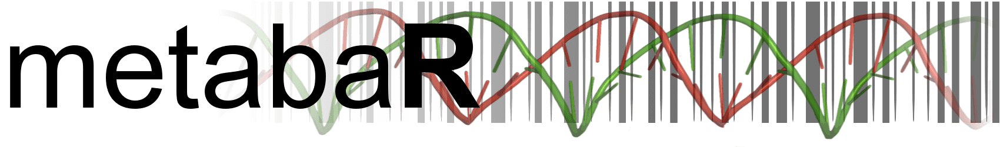
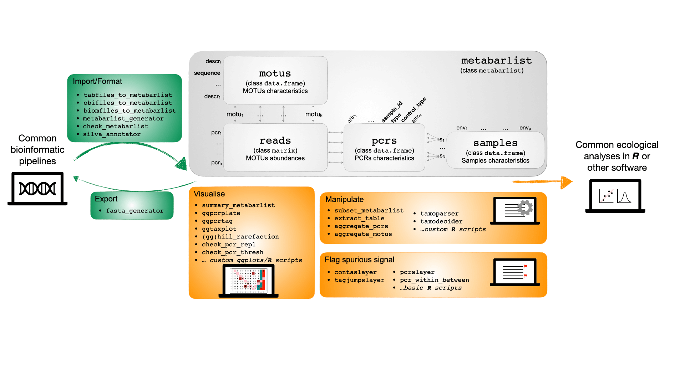

---
output:
  html_document:
    number_sections: no
    toc: no
  # pdf_document:
  #   toc: no
  #   fig_caption: true
---

<br/><br/>


```{css, echo=FALSE}
@import url('https://fonts.googleapis.com/css?family=Londrina+Solid:200,300|Medula+One');
header {
   font-family: 'Londrina Solid', cursive;
   font-weight: 300;
   font-size: 50px;
   line-height: 1.1;
   background-color: #d8d5d5;
   padding: 10px;
   margin-bottom: 50px;
   border-radius: 3px;
   color: #50555e;
}
h2 {
   background-color: #d8d5d5;
   padding: 10px;
   border-radius: 3px;
}
footer {
   background-color: #d8d5d5;
   padding: 10px;
   border-radius: 3px;
   text-align: right;
}
```

<header>Newsletter Pastis - Décembre 2020 </header>

<div style="text-align:right;">*En [bleu](), liens cliquables !*</div>
<br/>


#### Petites news :

- **[R in Grenoble- YouTube channel](https://www.youtube.com/channel/UCA2w7SQxsYH0NKGS8vmAqbg)** : 
    - pour pouvoir voir et revoir les présentations de R in Grenoble !
- **[R 4.0](https://www.r-project.org/)** : 
    - la toute dernière version de R !
    - quelques petits problèmes de dépendance sont à attendre entre les packages, mais ça va très vite devenir la version de référence... donc prenez votre courage à deux mains et installez la !


</br></br>


<div style="text-align:center;color:#980043;font-size:20px;">
**Nos fonctions fétiches sous R !** </br>
*Team PASTIS*
</div>

</br>

<div style="text-align:left;width:600px;border:solid;padding:10px;padding-top:20px;">
- <u style="color:#980043;">**`dudi.coa` du package `ade4` :**</u> </br> très utile pour détecter un signal biologique à partir de données de métabarcoding
- <u style="color:#980043;">**`rowSums` et `colSums` :**</u> </br> très utile pour faire des observations descriptives de début d'analyse en travaillant avec de grandes matrices
- <u style="color:#980043;">**`subset_metabarlist` du package `metabaR` :**</u> </br> permet de sélectionner rapidement un sous-ensemble de données d'un objet `metabarlist`

<div style="text-align:right;">*Clément Lionnet*</div>
</div>

</br>

<div style="margin-left:300px;width:600px;border:solid;padding:10px;padding-top:20px;">
- La fonction <u style="color:#980043;">**`tapply`**</u> permet de facilement pivoter les colonnes d'un dataframe. Encore mieux qu'un tableau croisé dynamique (ou [TCD](http://www.legorafi.fr/2017/04/27/il-se-forge-une-reputation-de-genie-apres-avoir-reussi-un-tableau-croise-dynamique/)) ! C'est très pratique pour faire des matrices sites X espèces par exemple. `df = tapply(df$abondance, list(df$site, df$species), mean)`
- <u style="color:#980043;">**`melt` du package `reshape2` :**</u> c'est un peu la fonction inverse de celle du dessus, elle permet de "dépivoter" une table et de vous renvoyer toutes les valeurs en lignes. C'est très pratique pour importer des données dans une BD, où les infos sont généralement stockées en ligne.
- La fonction <u style="color:#980043;">**`foreach` du package `foreach`**</u> utilisée simplement fonctionne comme une boucle `for`, mais le truc super c'est que l'on peut controler la structure de la sortie avec l'argument `.combine`	et par exemple faire des rbind de chaque itération pour récupérer au final un dataframe.

<div style="text-align:right;">*Julien Renaud*</div>
</div>

</br>

<div style="text-align:left;width:600px;border:solid;padding:10px;padding-top:20px;">
- <u style="color:#980043;">**`which`, `grep`, `sub` et `gsub` :**</u> </br> des fonctions de base que j'utilise presque tout le temps ! Les deux premières pour sélectionner des éléments d'un vecteur ou d'un tableau selon leurs caractéristiques ; les deux dernières pour corriger et uniformiser des chaînes de caractères.
- <u style="color:#980043;">**`expand.grid` :**</u> </br> pour créer toutes les combinaisons de plusieurs paramètres, super pour préparer une campagne de simulations ou une analyse de sensitivité !
- <u style="color:#980043;">**`dopar` du package `foreach` combiné avec le package `doParallel` :**</u> </br> ou comment paralléliser un code qui utilise foreach en 10 secondes ! En définissant le nombre de ressources sur lesquelles paralléliser avec `registerDoParallel(cores = ...)` et en remplaçant `%do%` par `%dopar%`. Malheureusement, ça ne marche pas sous Windows...

<div style="text-align:right;">*Maya Guéguen*</div>
</div>

</br>

<div style="margin-left:300px;width:600px;border:solid;padding:10px;padding-top:20px;">
- <u style="color:#980043;">**`lapply`, `do.call` :**</u> </br> en plus on peut les combiner pour bien s'amuser, genre `do.call(rbind, lapply(...))` que j'utilise régulièrement : Trop drôle !
- <u style="color:#980043;">**`outer`:**</u> </br> c'est pratique pour fabriquer des sélections sur des matrices basées sur les noms de lignes et colonnes. Par exemple pour extraire des valeurs particulières d'une matrice de distance, hyper top pratique !
- Et j'ai découvert il y pas longtemps <u style="color:#980043;">**`recordPlot`, `replayPlot` :**</u> </br> couple ultime de fonctions pour rajouter des détails à une figure qu'on met des plombes à fabriquer, par exemple un fond de carte ? 

<div style="text-align:right;">*Frédéric Boyer*</div>
</div>


<br/><br/>

## [Zoom sur...]()

</br>

<div style="text-align:center;">**Package metabaR**

`MetabaR` est un package R développé pour faciliter la manipulation des données de métabarcoding.

"*Zinger L, Lionnet C, Benoiston AS, Donald J, Mercier C, Boyer F (2020) <br/> metabaR : an R package for the evaluation and improvement of DNA metabarcoding data quality*"

Il vient compléter les analyses obitools en proposant des fonctions de détection et de filtrage des artefacts moléculaires communs produits au cours du process expérimental. Il fournit aussi des systèmes graphiques flexibles basés sur `ggplot2` pour visualiser les données dans une perspective à la fois écologique et expérimentale.

Pour finir il peut être facilement combiné avec d'autre packages R couramment utilisés en écologie (`vegan`, `ade4`...).


Le package est disponible à l'adresse suivante : https://github.com/metabaRfactory/metabaR </br>
L'article est disponible à cette adresse : https://www.biorxiv.org/content/10.1101/2020.08.28.271817v1
</diV>

</br>

<div style="text-align:right;">*Clément Lionnet & Frédéric Boyer*</div>

<br/>

<div style="text-align:center;">


</div>


<br/><br/>
<br/><br/>


## [Documentation - Archives]()


- [RLeca](http://rleca.pbworks.com/) :

      - scripts R
      - tutoriels ggplot2, biomod2...
      - documentation pour modèles mixtes, analyses multivariées, SIG...
      - tutoriels UNIX, OBITOOLS, CIMENT, LaTeX
      
- [LSD](https://gricad-gitlab.univ-grenoble-alpes.fr/leca/pastis/lsd) : LECA Script Directory (identifiants AGALAN)

      - script R, python... pour extraction et analyse de données, traitement de séquences ADN, etc
      - liens vers de la documentation en ligne (R, SIG, best coding practices...)
      - tutoriels
      
- [LECA Androsace](https://androsace.osug.fr/) : BDD traits fonctionnels des plantes alpines
- [LECA Geonetwork](http://leca-bdgis.u-ga.fr/geonetwork/srv/fre/catalog.search#/home) : portail de métadonnées
- [LECA ORCHAMP](https://orchamp.osug.fr/) : Observatoire spatio-temporel de la biodiversité et du fonctionnement des socio-écosystèmes de montagne

- [OBITools3](https://git.metabarcoding.org/obitools/obitools3) : package for the management of analyses and data in DNA metabarcoding

- [Documentation utilisateur GriCAD](https://gricad-doc.univ-grenoble-alpes.fr/) : pour les différents services fournis par l'UMS :

      - GitLAB : forge logicielle
      - NOVA : machines virtuelles OpenStack
      - CIMENT : calcul intensif
      - Jupyter notebook

<br/>

#### [Archives newsletters](https://leca-dev.github.io/newsletters/)

<br/><br/>

<footer>*Rédigé par Maya Guéguen, le 12 novembre 2020*</footer>

<br/><br/>
