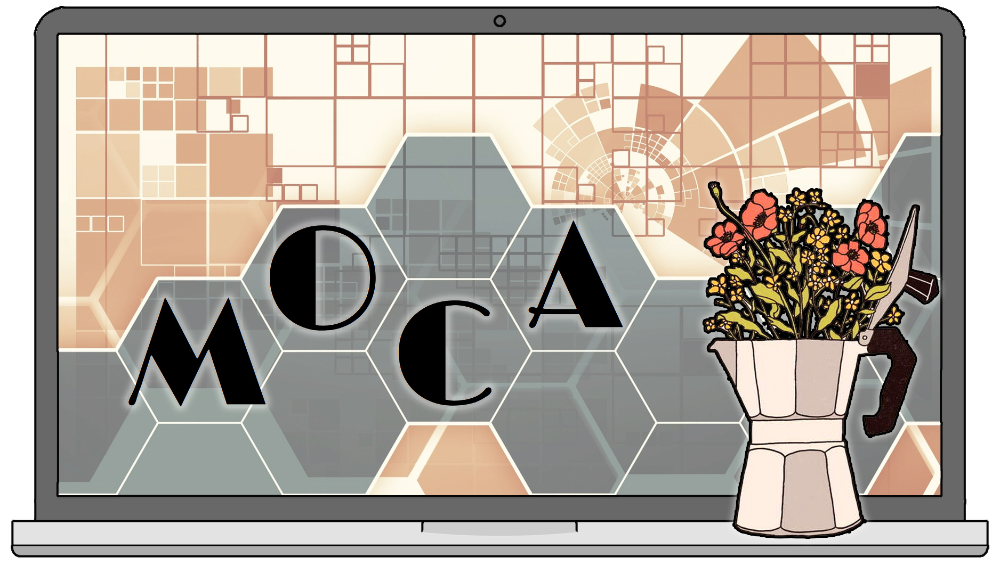

---
output:
  html_document:
    number_sections: no
    toc: no
---

<br/><br/>


```{css, echo=FALSE}
@import url('https://fonts.googleapis.com/css?family=Londrina+Solid:200,300|Medula+One');
header {
   font-family: 'Londrina Solid', cursive;
   font-weight: 300;
   font-size: 50px;
   line-height: 1.1;
   background-color: #d8d5d5;
   padding: 10px;
   margin-bottom: 50px;
   border-radius: 3px;
   color: #50555e;
}
h2, h3 {
   padding: 10px;
   border-radius: 3px;
   color: #50555e;
   font-family: 'Londrina Solid', cursive;
}
h2 {
   background-color: #e6c49f;
}
h3 {
   background-color: #d8d5d5;
}
footer {
   background-color: #d8d5d5;
   padding: 10px;
   border-radius: 3px;
   text-align: right;
   color: #50555e;
}
```

<header>
Newsletter MOCA - Juin 2026 
<span style="float:right;">

&nbsp;

</span>
</header>

<div style="text-align:right;">*En [bleu](), liens cliquables !*</div>
<br/>


<div style="text-align:center;">
**Long time no see !**
</div>


Si vous voulez contribuer au recensement de la Bibliothèque du LECA, [c'est ici :)](https://docs.google.com/spreadsheets/d/1f76E9yOZLzyLES1LTQqRttLVTeqHBoQJS16AE9eCHWQ/edit?usp=sharing)


</br></br>


## GRICAD - Update Mai 2026

Plusieurs chantiers ont impacté les clusters de GRICAD ce dernier mois (faille de sécurité + passage à OAR3) :

- Certaines **connexions SSH** ont changé. Vous pouvez :
    - [Windows] *pas de problème normalement via WinSCP*
    - [Unix / MAC] si vous vous connectiez avec `ssh dahu`, la réinitialiser en faisant `ssh-keygend -R dahu` avant de vous connecter.
    - [Unix / MAC] refaire tous vos raccourcis de connexion à l'aide du script `set_up_ciment_connections.sh` :
        * placer le script dans votre Dossier personnel
        * ouvrir un terminal et taper les commandes ci-dessous
        * *Taper Entrée pour choisir le fichier pour le passphrase*
        * *Utiliser par exemple votre password AGALAN pour le passphrase*
        * *Taper `yes` et votre password AGALAN autant de fois que demandé*
```{bash eval=FALSE}
cd
rm -r .ssh
mkdir .ssh
chmod +x set_up_ciment_connections.sh
./set_up_ciment_connections.sh monidAGALAN
```

<br/> 

- Pour rappel, lorsque vous voulez **transférer des fichiers volumineux** (uploader ou télécharger), vous devez passer par **Cargo**. Vous vous connectez à Cargo comme vous vous connecteriez à un cluster (Dahu, Luke, etc), et vous arrivez par défaut dans votre *home* Dahu, mais **tous les espaces du cluster peuvent être accédés depuis ce point** ! Voici les chemins :
    - Dahu : `/home/monidAGALAN/`
    - Bigfoot : `/home-bigfoot/monidAGALAN/`
    - Luke : `/home-luke/monidAGALAN/`
    - Kraken : `/home-kraken-cpu/monidAGALAN/` ou `/home-kraken-gpu/monidAGALAN/`
    - Stockages / Scratch : `/bettik/`, `/silenus/` ou `/summer/`
    - Mantis : via commandes iRODS

<br/>

- Pour l'environnement **Conda** : rien ne change, mais petit update des lignes de commande dans le tutoriel 2
- Pour l'environnement **Nix** : c'est un peu + le bazar...
    - La commande `nix-env` ne marche plus, il faut passer à `nix profile`...
    - ... ce qui fait que l'installation généralisée des packages R via le fichier `.config/nixpkgs/config.nix` ne marche plus...
    - ... parce que ça passerait maintenant via des *flakes* mais ça n'a pas l'air encore au point (:
        * [Ce fichier `flake.nix`](https://github.com/bzizou/sysadmin/blob/master/nix_environments/R/flake.nix) a vocation si j'ai bien compris, à remplacer le fichier `.config/nixpkgs/config.nix`
        * MAIS il doit être placé dans votre `/home/monidAGALAN/` directement, et lancé avec la commande `nix profile install`
        * MAIS le test fait ainsi n'a pas marché...
        * Lancer directement la commande `nix profile install github:bzizou/sysadmin?dir=nix_environments/R` sans utiliser le fichier `flake.nix` a l'air de marcher, mais vous n'avez pas la main sur les packages inscrits dans le fichier...
    - Donc pour l'instant, il faut soit revenir à l'installation à la main via `install.packages` pour compléter
    - Soit passer à Conda (où il faut aussi installer les packages à la main, mais ça semble faire moins de surprises ?)

<br/>

- **Passage de OAR2 à OAR3** sur tous les clusters (sauf Luke) :
    - Dans les faits, c'est pas très clair ce qui est nouveau ou pas...
    - L'option `-t heterogeneous` n'est plus reconnue par `oarsub`

<br/>

*Tous les fichiers / tutoriels ont été updatés sur RLeca et LSD.*


</br></br>


## Gérer vos données / codes

Plusieurs outils sont à votre disposition pour partager vos codes / données.

*Gérés par Maya :*

- L'[organisation `leca-dev` sur github](https://github.com/leca-dev) peut héberger vos projets de développement.
- Le [groupe `LECA` sur gricad-gitlab](https://gricad-gitlab.univ-grenoble-alpes.fr/leca) peut vous permettre la même chose de façon fermée. <br/>
Et plusieurs scripts sont partagés dans le sous-dossier `PASTIS/LSD/`
- Le [siteweb RLeca](http://rleca.pbworks.com/) se fait un peu vieux mais reste pratique pour partager des scripts ou des tutoriels.
- La [page PRODUCTION/Logiciels/ sur le site web du LECA](https://leca.osug.fr/-Logiciels-169-) peut accueillir vos descriptions de packages / softwares.

*Gérés par Julien :*

- Le [dataverse LECA usr data.InDoRES](https://data.indores.fr/dataverse/LECA) permet de partager vos données et codes (similaire à Zenodo par exemple).
- Le [catalogue cat.InDoRES](https://cat.indores.fr/geonetwork/srv/eng/catalog.search) recueille les métadonnées de tous vos dépots et ressources en ligne.

*Gérés pas par MOCA :*

- [HAL](https://hal.science/) permet de déposer des publications et leurs métadonnées, mais également plein d'autres supports, dont des logiciels.
- [Software Heritage](https://www.softwareheritage.org/) est une archive universelle de logiciels qui collecte toutes les ressources codes qu'elle trouve en ligne. Vous pouvez vérifier si votre code s'y trouve déjà, ou bien le soumettre sinon.

<br/><br/>
<br/><br/>


### Documentation - Archives


- [RLeca](http://rleca.pbworks.com/) :

      - scripts R
      - tutoriels ggplot2, biomod2...
      - documentation pour modèles mixtes, analyses multivariées, SIG...
      - tutoriels UNIX, OBITOOLS, CIMENT, LaTeX

- [LECA github](https://github.com/leca-dev)
- [LECA gitlab](https://gricad-gitlab.univ-grenoble-alpes.fr/leca/) (identifiants AGALAN)
- [LSD](https://gricad-gitlab.univ-grenoble-alpes.fr/leca/pastis/lsd) : LECA Script Directory (identifiants AGALAN)

      - script R, python... pour extraction et analyse de données, traitement de séquences ADN, etc
      - liens vers de la documentation en ligne (R, SIG, best coding practices...)
      - tutoriels

- [OBITools3](https://git.metabarcoding.org/obitools/obitools3) : package for the management of analyses and data in DNA metabarcoding

- [LECA Androsace](http://originalps.osug.fr) : BDD traits fonctionnels des plantes alpines
- [LECA ORCHAMP](https://orchamp.osug.fr/) : Observatoire spatio-temporel de la biodiversité et du fonctionnement des socio-écosystèmes de montagne

- [LECA data.InDoRES dataverse](https://data.indores.fr/dataverse/LECA)
- [cat.InDoRES geocatalog](https://cat.indores.fr/geonetwork/srv/eng/catalog.search)


<br/>

#### [Archives newsletters](https://leca-dev.github.io/newsletters/)

<br/><br/>

<footer>*Rédigé par Maya Guéguen, le 5 juin 2026*</footer>

<br/><br/>
